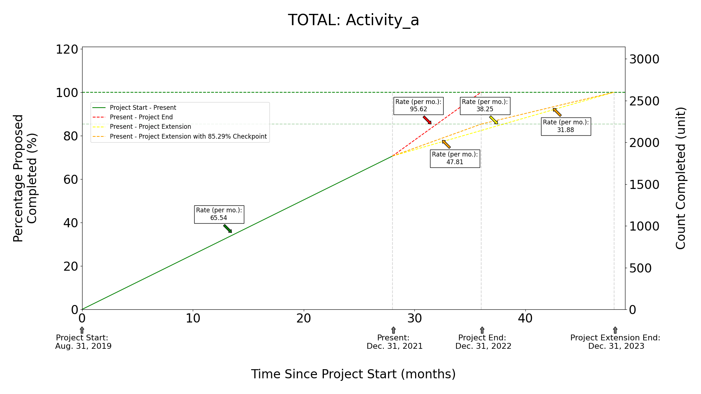

=================
DIGITIZATION PROGRESS REPORTS
=================

A resource for generating digitization effort graphs (or other efforts) on-the-fly.

More generally, for a series of entities (e.g., "Collections") and a series of activities
(e.g., "High Resolution Images"), this project takes a count of:

#. Total proposed units of activity
#. Completed units of activity

combined with:

#. Project Start
#. Present Time Point
#. Project End
#. Project Extension End

and generates a figure like this:

As a starting point, try the data template file `here <https://github.com/njdowdy/digitization_progress_reports/blob/master/digitization_progress_reports/application/input/input_template.csv>`_.

HOW TO USE
^^^^^^^^^^
#. Ensure ``docker`` is installed on your system (see: `here <https://docs.docker.com/get-docker/>`_)
#. Ensure ``docker-compose`` is installed on your system (see: `here <https://docs.docker.com/compose/install/>`_)
#. Run from the directory of your choice:
    - ``git clone https://github.com/njdowdy/digitization_progress_reports.git``
    - ``cd digitization_progress_reports``
#. Add your file to process into ``digitization_progress_reports/application/input/``
#. Adjust ``application/run.py`` to reflect the path to your file and adjust other options as needed
#. Run: ``sudo make dc-start`` or ``sudo make dc-start-verbose``

**All commands**
----

| help                    Show this help menu
| dc-stop                 Stop docker (might need sudo)
| dc-start                Start docker (might need sudo)

To update the source code:
    #. ``git pull origin``

CONTACT
^^^^^^^^^^
Please report issues or questions `here <https://github.com/njdowdy/digitization_progress_reports/issues>`_.
